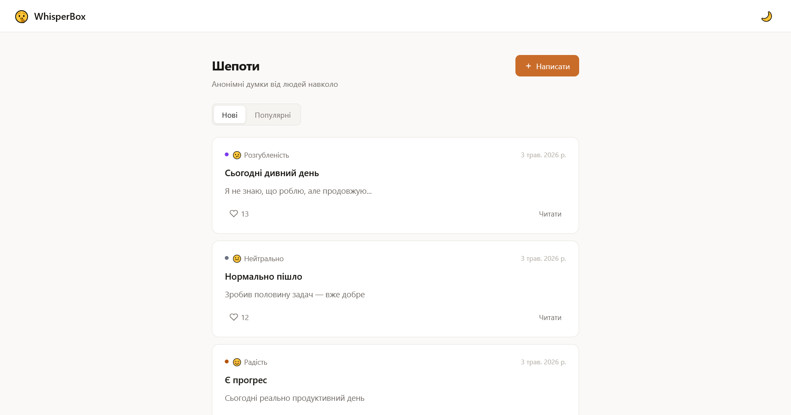
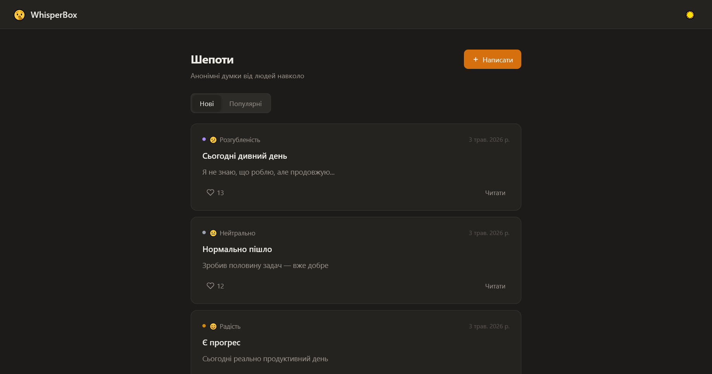
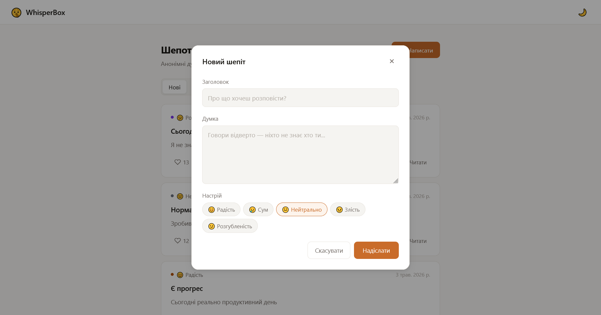
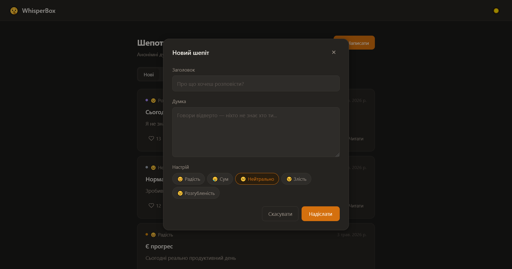

# 🤫 WhisperBox

Анонімна дошка думок. Залишай шепоти, ставь лайки — без реєстрації, без імен.

<table>
    
    
    
    
</table>

---

## Структура

```
whisper-box-laravel/
├── backend/    — Laravel 13 API
├── frontend/   — Vue 3 SPA
└── docs/
    └── screenshots/
```

## Швидкий старт

### 1. Бекенд (Laravel)

```bash
cd backend
composer install
cp .env.example .env
php artisan key:generate
php artisan migrate
php artisan serve        # http://localhost:8000
```

### 2. Фронтенд (Vue 3 + Vite)

```bash
cd frontend
npm install
npm run dev              # http://localhost:5173
```

Vite автоматично проксіює `/api` → `http://localhost:8000`, тому CORS-проблем немає.

---

## Функціонал

| Функція | Опис |
|---|---|
| Стрічка нотаток | Список усіх шепотів, сортування за новизною або популярністю |
| Перегляд нотатки | Окрема сторінка з повним текстом |
| Створення | Форма з заголовком, текстом і настроєм |
| Лайки | Один клік — один лайк |
| Настрої | 😊 😢 😐 😠 😕 |
| Теми | Світла та темна, зберігається у браузері |

## API

Детальна документація: [`backend/README.md`](./backend/README.md)

| Метод | URL | Опис |
|---|---|---|
| `GET` | `/api/notes` | Список нотаток (`?sort=latest\|popular`) |
| `GET` | `/api/notes/:id` | Одна нотатка |
| `POST` | `/api/notes` | Створити нотатку |
| `POST` | `/api/notes/:id/like` | Поставити лайк |

## Технології

**Backend:** PHP 8, Laravel 13, SQLite / MySQL  
**Frontend:** Vue 3, Vue Router 4, Vite 5
